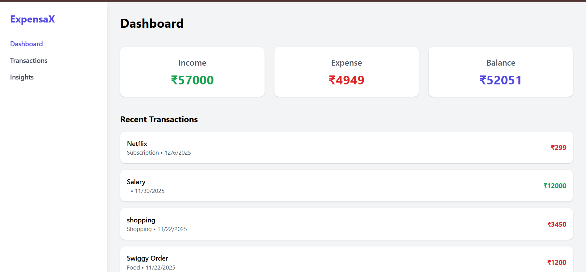
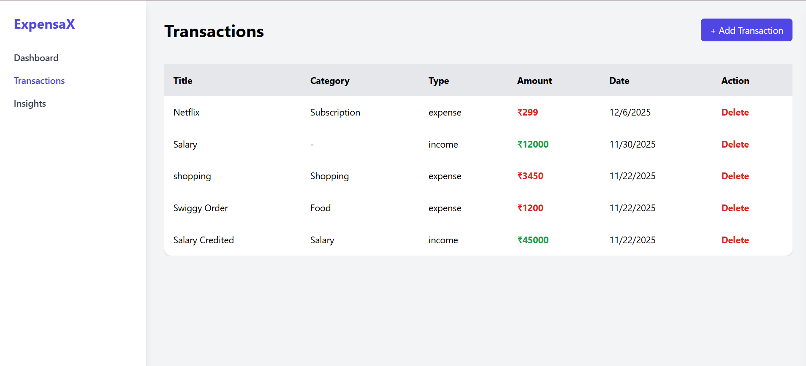
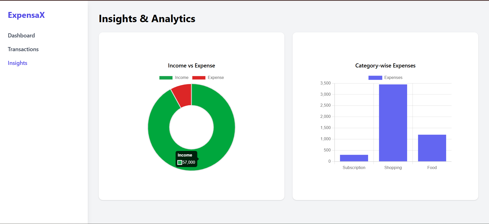

# ExpensaX 💰

A full-stack personal finance and expense tracking web application built using **Node.js, Express, MongoDB, Tailwind CSS, and JavaScript**. ExpensaX helps users track their income, expenses, categories, and visualize spending behaviour with charts.

---

## 🚀 Features
- Dashboard with Total Income, Expense & Balance
- Add & Delete Transactions
- Category Management (Food, Rent, Shopping, Subscriptions, etc.)
- Insights with Charts (Pie & Bar) using Chart.js
- Responsive UI with slide-in Add Transaction panel
- REST API backend with Node.js & Express
- MongoDB as database with Mongoose

---

## 🏗 Tech Stack
| Category | Technology |
|----------|------------|
| Frontend | HTML, Tailwind CSS, JavaScript |
| Backend | Node.js, Express.js |
| Database | MongoDB, Mongoose |
| Charts | Chart.js |
| Tools | Postman, VS Code, Git & GitHub |

---

## 🖼 Screenshots

### Dashboard View


### Transaction View


### Insight View


---

## 📦 Installation & Setup

### 1️⃣ Clone Repository
```bash
git clone https://github.com/Shashank1-6/ExpensaX-Personal-Finance-Web-App.git
cd ExpensaX-Personal-Finance-Web-App
